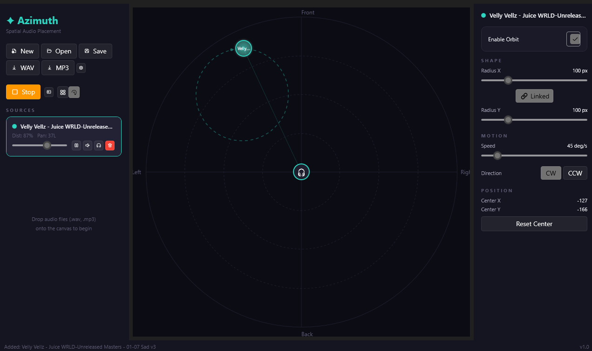

<div align="center">

# ✦ Azimuth

**Spatial audio placement tool for Windows**

Place, move, and orbit audio sources on a 2D stage — hear them pan and fade in real-time.

[](https://dotnet.microsoft.com/)
[](https://learn.microsoft.com/en-us/dotnet/desktop/wpf/)
[](LICENSE)
[](https://github.com/mwdlyt/Azimuth/releases)

<br/>

<!-- Add a screenshot: take one with sources on canvas + orbit paths visible, save as docs/screenshot.png -->
<!--  -->

<sub>*Drop audio files onto the circular stage. Drag them around. Hear the difference.*</sub>

</div>

---

## What is this?

Azimuth is a desktop tool for **spatial audio design**. You have a circular 2D stage with a listener at the center. Drop audio files onto it — each one becomes a draggable node with real-time stereo panning and distance-based volume attenuation.

Think of it as a mixing board, but visual and spatial.

## Features

### 🎧 Spatial Audio Engine
- **Real-time panning & attenuation** — position determines stereo pan and volume via inverse-square falloff
- **Extended depth** — sources beyond the visible canvas still produce audio, just progressively quieter
- **Multi-format** — WAV, MP3, FLAC, OGG, AAC, WMA, M4A, AIFF, OPUS
- **Per-source controls** — play/pause, mute, solo, volume slider
- **Looping playback** — sources loop seamlessly

### 🌀 Orbital Motion
- **Circular & elliptical orbits** — sources automatically move along configurable paths
- **60fps animation** — smooth real-time spatial audio updates as sources orbit
- **Per-source orbit settings** — radius X/Y, speed (°/s), direction (CW/CCW)
- **Linkable radii** — lock X/Y for perfect circles, or unlink for ellipses
- **Canvas visualization** — dashed orbit paths drawn in source color

### 🎨 Canvas & UI
- **Dark theme** — deep blacks (#0D0D0F), muted surfaces, violet (#7C5CFC) accent
- **Fluent Design** — built on [WPF-UI](https://github.com/lepoco/wpfui) for native Windows 11 look
- **Distance rings** — visual guides at 25%, 50%, 75%, 100% of the stage
- **Snap-to-grid** — toggleable grid overlay with dot markers
- **Timeline panel** — per-source waveform scrubbers with seek
- **Source selection** — click to select, highlighted on canvas and sidebar

### 💾 Project Management
- **Save/Load scenes** — `.azimuth` JSON files with all source positions, orbits, and settings
- **Export to WAV/MP3** — render the spatial mix to a stereo file
- **Recent files** — quick access to last 10 scenes
- **Settings** — sample rate, distance falloff, grid size, startup preferences

### ⌨️ Keyboard Shortcuts

| Shortcut | Action |
|----------|--------|
| `Ctrl+S` | Save |
| `Ctrl+Shift+S` | Save As |
| `Ctrl+O` | Open |
| `Ctrl+N` | New Scene |
| `Ctrl+Z` | Undo |
| `Ctrl+Y` / `Ctrl+Shift+Z` | Redo |
| `Space` | Play / Stop All |
| `Delete` | Remove selected source |
| `Escape` | Deselect |
| `G` | Toggle snap-to-grid |
| `O` | Toggle orbit on selected source |

### 🔄 Undo/Redo
Full command-pattern undo system — move, add, remove, and volume changes are all reversible. 100-deep stack.

---

## Getting Started

### Requirements
- Windows 10/11 (x64)
- [.NET 8 SDK](https://dotnet.microsoft.com/download/dotnet/8.0)

### Build & Run

```bash
git clone https://github.com/mwdlyt/Azimuth.git
cd Azimuth
dotnet run --project Azimuth
```

### Publish (single exe)

```bash
dotnet publish -c Release -r win-x64 --self-contained -p:PublishSingleFile=true
```

Output: `Azimuth/bin/Release/net8.0-windows/win-x64/publish/Azimuth.exe`

---

## Scene File Format

Scenes are saved as `.azimuth` JSON files:

```json
{
  "version": 1,
  "name": "My Scene",
  "canvasRadius": 400,
  "sources": [
    {
      "id": "...",
      "name": "rain",
      "filePath": "C:/audio/rain.wav",
      "x": 120,
      "y": -80,
      "baseVolume": 0.8,
      "isMuted": false,
      "color": "#7C5CFC",
      "orbitEnabled": true,
      "orbitRadiusX": 150,
      "orbitRadiusY": 150,
      "orbitSpeed": 45,
      "orbitClockwise": true
    }
  ]
}
```

---

## Tech Stack

| Component | Technology |
|-----------|------------|
| Framework | .NET 8 / WPF |
| UI | [WPF-UI](https://github.com/lepoco/wpfui) (Fluent Design) |
| Audio | [NAudio](https://github.com/naudio/NAudio) |
| MP3 Export | [NAudio.Lame](https://github.com/Corey-M/NAudio.Lame) |
| Vorbis/OGG | [NAudio.Vorbis](https://github.com/naudio/Vorbis) |
| Serialization | System.Text.Json |

## Architecture

```
Azimuth/
├── Models/          # Data models (AudioSource, AzimuthScene, AppConfig)
├── ViewModels/      # MVVM view models (MainViewModel, AudioSourceViewModel)
├── Services/        # Audio engine, spatial math, serialization, settings
├── Commands/        # Undo/redo command pattern implementations
├── Controls/        # Custom WPF controls (SpatialCanvas, SourceNode, OrbitPanel, Timeline)
├── Views/           # Settings window
├── Converters/      # WPF value converters
└── Assets/          # Icons and resources
```

---

## Roadmap

- [ ] Automation keyframes — animate source positions over time
- [ ] 3D elevation — add height axis with HRTF spatialization
- [ ] Plugin system — custom audio effects per source
- [ ] MIDI control — map source positions to MIDI controllers
- [ ] Multi-listener — multiple listener positions for surround setups

---

## License

[MIT](LICENSE) — do whatever you want with it.

---

<div align="center">
<sub>Built by <a href="https://github.com/mwdlyt">mwdlyt</a></sub>
</div>
